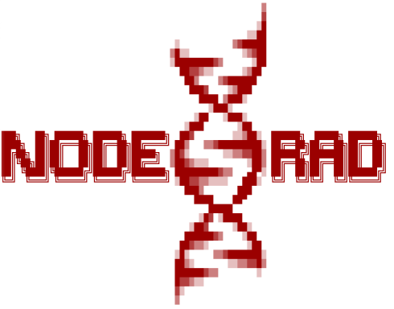

# Snakemake workflow: NodeRAD


[](https://snakemake.bitbucket.io)
[](https://github.com/AntonieV/NodeRAD/actions?query=branch%3Amaster+workflow%3ATests)




<!-- <pre>
<span style="color:darkred">
                                                      ▒                         
                                                      ▓                         
                                                     ░█                         
                                                   ░░██                         
                                    ░           ▒▓█████                         
                                   ▒█░░           ░▒▓██                         
                                   ░████████▓▒      ░██                         
                                     ██▓▓▒░░      ░▒██                          
                                      ██▒    ▒▓██████                           
                                       ███▓    ░▒███                            
                                         ████ ▒███░                             
                                           ░███░                                
                                        ░██   ░███░                             
                                      ░███       ░██                            
███╗   ██╗ ██████╗ ██████╗ ███████╗  ██▓        ░░▒██░  ██████╗  █████╗ ██████╗ 
████╗  ██║██╔═══██╗██╔══██╗██╔════╝ ██▒   ▒▒▓█████████░ ██╔══██╗██╔══██╗██╔══██╗
██╔██╗ ██║██║   ██║██║  ██║█████╗  ▒█▓░       ░░▒▒▓▓██▒ ██████╔╝███████║██║  ██║
██║╚██╗██║██║   ██║██║  ██║██╔══╝  ▒██▓▒░░░        ░██▒ ██╔══██╗██╔══██║██║  ██║
██║ ╚████║╚██████╔╝██████╔╝███████╗ █████████▓▒▒   ▄█▀░ ██║  ██║██║  ██║██████╔╝
╚═╝  ╚═══╝ ╚═════╝ ╚═════╝ ╚══════╝ ░██▓▓▒▒░░░░   ███░  ╚═╝  ╚═╝╚═╝  ╚═╝╚═════╝ 
                                      ███▒       ███                            
                                        ████    ██▀                             
                                           █████                                
                                         ░█▓ ░████                              
                                       ░██▓     ░██░                            
                                      ██████▓▒    ░██                           
                                     ██▓▒▒░        ░██                          
                                    ░█░     ▒▒▓███████░                         
                                    ██▒░       ░░▒▒▓▓█▒                         
                                    ██████▓▒▒        ░                          
                                    █▓▓▒░░                                      
                                    ▓░                                          
                                    ▒                                           
</span>
</pre> -->
NodeRAD is a [Snakemake](https://github.com/snakemake/snakemake) workflow for analysis of single-end reads from RAD sequencing without the presence of a reference genome. It detects loci and genomic variants using sequencing error and heterozygosity rates. For more information please have a look at the associated [bachelor thesis](https://raw.githubusercontent.com/AntonieV/RADSeq/main/main.pdf).

**Note:** Currently the workflow is limited to diploid species.

## Authors

* Antonie Vietor (@AntonieV)

This workflow is part of a [bachelor thesis](https://raw.githubusercontent.com/AntonieV/RADSeq/main/main.pdf) The topic and the underlying model were developed by:

* Johannes Köster (@johanneskoester), https://koesterlab.github.io

## Usage

If you use this workflow in a paper, don't forget to give credits to the authors by citing the URL of this (original) repository and, if available, its DOI (see above).

### Step 1: Obtain a copy of this workflow

1. Create a new GitHub repository using this workflow [as a template](https://help.github.com/en/articles/creating-a-repository-from-a-template).
2. [Clone](https://help.github.com/en/articles/cloning-a-repository) the newly created repository to your local system, into the place where you want to perform the data analysis.

### Step 2: Configure workflow

Configure the workflow according to your needs via editing the files in the `config/` folder. Adjust `config.yaml` to configure the workflow execution, and `samples.tsv` to specify your sample setup.

### Step 3: Install Snakemake

1. Install [conda](https://conda.io/projects/conda/en/latest/user-guide/install/index.html).
2. Install [mamba](https://github.com/mamba-org/mamba) in conda base and create a snakemake conda environment:
```bash
    conda install -n base -c conda-forge mamba
    conda create -c bioconda -c conda-forge -n snakemake snakemake
```

For installation details, see the [instructions in the Snakemake documentation](https://snakemake.readthedocs.io/en/stable/getting_started/installation.html).

### Step 4: Execute workflow

You can run the workflow with some examples through the script **start.sh**. To use your own data, change the paths in `config/config.yaml` for `samples`, `fastq-data` and `eval-data` (if there is data from a ddRAGE simulation). 

Activate the conda environment:

    conda activate snakemake

Test your configuration by performing a dry-run via

    snakemake --use-conda --conda-frontend mamba -n

Execute the workflow locally via

    snakemake --use-conda --conda-frontend mamba --cores $N

using `$N` cores or run it in a cluster environment via

    snakemake --use-conda --conda-frontend mamba --cluster qsub --jobs 100

or

    snakemake --use-conda --conda-frontend mamba --drmaa --jobs 100

If you not only want to fix the software stack but also the underlying OS, use

    snakemake --use-conda --conda-frontend mamba --use-singularity

in combination with any of the modes above.
See the [Snakemake documentation](https://snakemake.readthedocs.io/en/stable/executable.html) for further details.

### Step 5: Investigate results

After successful execution, you can create a self-contained interactive HTML report with all results via:

    snakemake --report report.html

This report can, e.g., be forwarded to your collaborators.
An example (using some trivial test data) can be seen [here](https://cdn.rawgit.com/snakemake-workflows/rna-seq-kallisto-sleuth/master/.test/report.html).

### Step 6: Commit changes

Whenever you change something, don't forget to commit the changes back to your github copy of the repository:

    git commit -a
    git push


### Step 7: Obtain updates from upstream

Whenever you want to synchronize your workflow copy with new developments from upstream, do the following.

1. Once, register the upstream repository in your local copy: `git remote add -f upstream git@github.com:TharjaX/NodeRAD.git` or `git remote add -f upstream https://github.com/TharjaX/NodeRAD.git` if you do not have setup ssh keys.
2. Update the upstream version: `git fetch upstream`.
3. Create a diff with the current version: `git diff HEAD upstream/master workflow > upstream-changes.diff`.
4. Investigate the changes: `vim upstream-changes.diff`.
5. Apply the modified diff via: `git apply upstream-changes.diff`.
6. Carefully check whether you need to update the config files: `git diff HEAD upstream/master config`. If so, do it manually, and only where necessary, since you would otherwise likely overwrite your settings and samples.


### Step 8: Contribute back

In case you have also changed or added steps, please consider contributing them back to the original repository:

1. [Fork](https://help.github.com/en/articles/fork-a-repo) the original repo to a personal or lab account.
2. [Clone](https://help.github.com/en/articles/cloning-a-repository) the fork to your local system, to a different place than where you ran your analysis.
3. Copy the modified files from your analysis to the clone of your fork, e.g., `cp -r workflow path/to/fork`. Make sure to **not** accidentally copy config file contents or sample sheets. Instead, manually update the example config files if necessary.
4. Commit and push your changes to your fork.
5. Create a [pull request](https://help.github.com/en/articles/creating-a-pull-request) against the original repository.

## Testing

More test cases are in the subfolder `.test`. To run the workflow with one of the test data sets adjust the paths for `samples`, `fastq-data` and `eval-data` in `.test/config/config.yaml` for the desired test dataset and run the script **start_test.sh**. Also note that for the different data sets you may have to adjust the threshold values in the configuration file. Test cases are also automatically executed via continuous integration with [Github Actions](https://github.com/features/actions).

